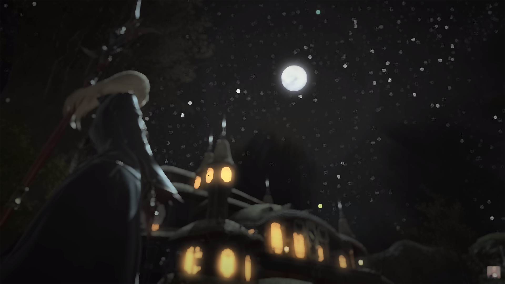
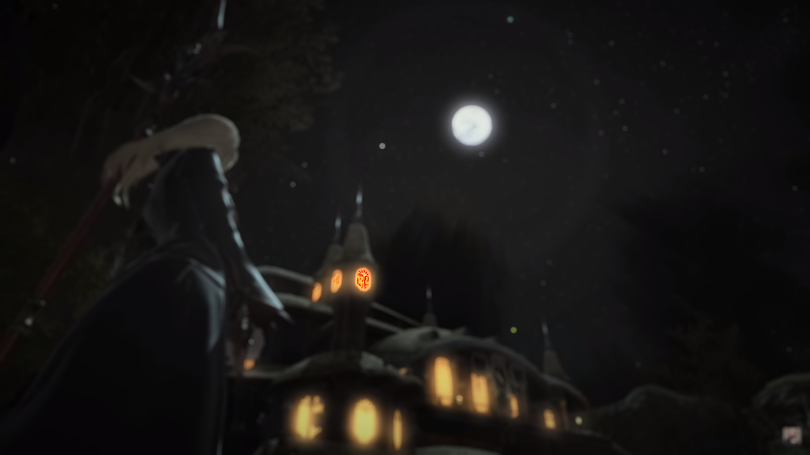
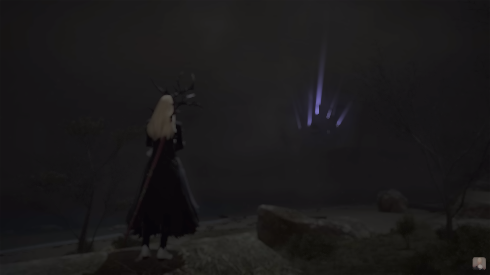

# Bokeh Plus
A sample based bokeh simulator that uses inverse tonemapping and weighted (by luminance) sample averaging to produce a bokeh effect.

inspiration from [https://www.youtube.com/watch?v=v9x_50czf-4](https://www.youtube.com/watch?v=v9x_50czf-4)

## Usage

```bash
python3 bokeh.py img.png out.png
```

## Examples

### This Method



### No Weighting



### Original


### This Method



# Requirements

- Python 3
- Numpy
- cv2
- matplotlib
- numba

Gholamreza Dar Jun 2023 when I should be doing other things!